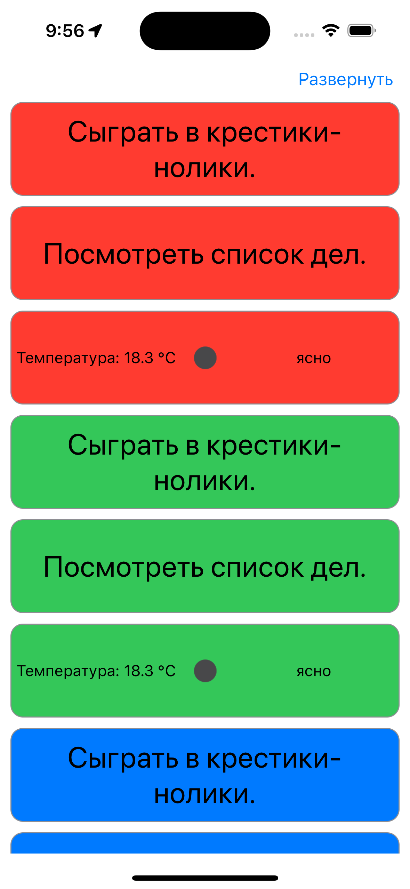
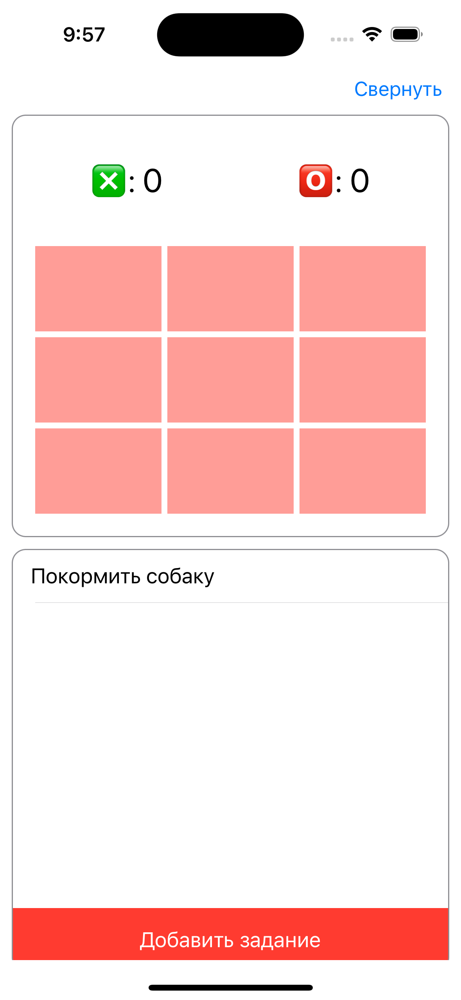
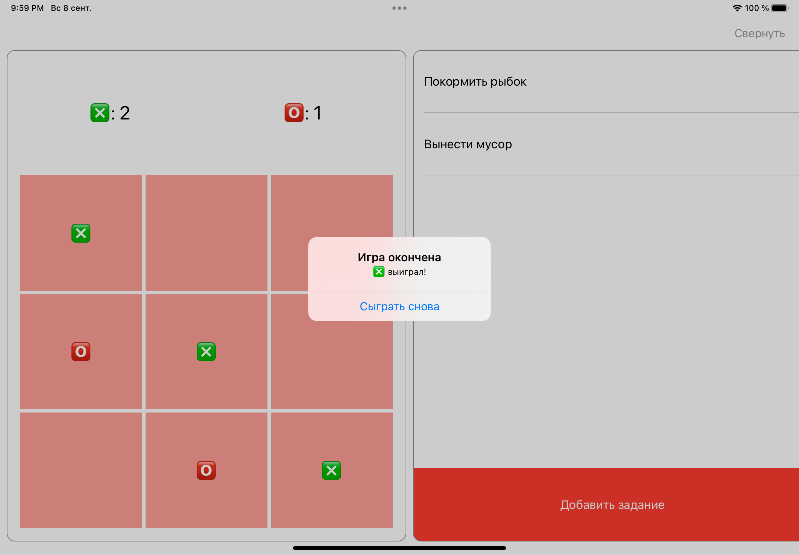
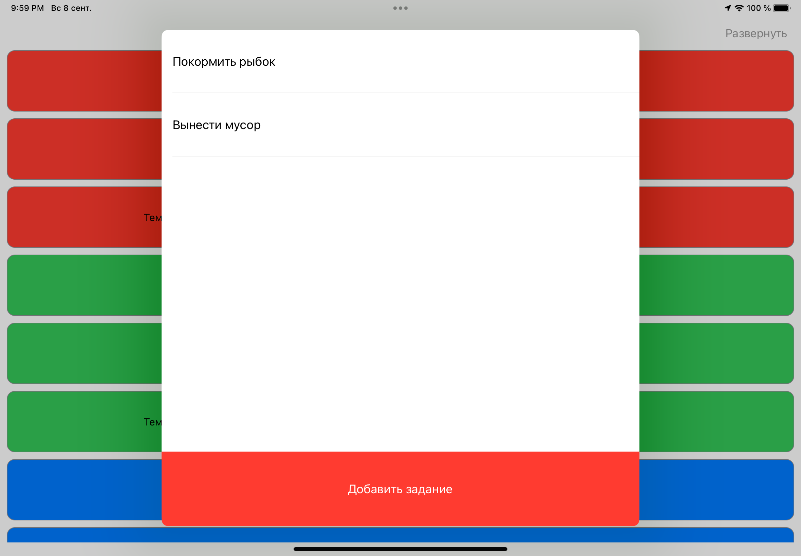

# MiniAppsForOK

MiniAppsForOK — это приложение с набором небольших мини-приложений, предназначенных для использования в экосистеме "Одноклассники" (OK). Этот проект создан в качестве тестового задания и 
предназначен для демонстрации моего накопленного опыта в разработке для платформы iOS.

## Особенности

- Примеры мини-приложений для платформы OK
- Различные режимы отображения
- Адаптировано для альбомной и портретной ориентации на iPad

## Превью интерфейса

&nbsp;


&nbsp;

## Мини-приложения:

- **Погодный виджет**: Просматривайте прогноз погоды в текущем месте, используя это мини-приложение([WeatherMiniApp](https://github.com/deemoji/WeatherMiniApp)).
- **Крестики-нолики**: Проведите свое время за неустаревающей классикой([TickTackToeMiniApp](https://github.com/deemoji/TickTackToeMiniApp)).
- **Todo список**: Записывайте свои задачи и выполняйте их вместе с этим мини-приложением([TodoMiniApp](https://github.com/deemoji/TodoMiniApp)).


## Установка

Чтобы установить и запустить проект, выполните следующие шаги:

1. Клонируйте репозиторий на свой локальный компьютер, используя команду:

    ```bash
    git clone https://github.com/deemoji/MiniAppsForOK.git
    ```
2. Перейдите в директорию проекта:

    ```bash
    cd MiniAppsForOK
    ```

3. Откройте проект в Xcode:

    ```bash
    open MiniAppsForOK.xcodeproj
    ```

4. Нажмите кнопку "Run" (или используйте сочетание клавиш `Cmd + R`), чтобы собрать и запустить проект.
